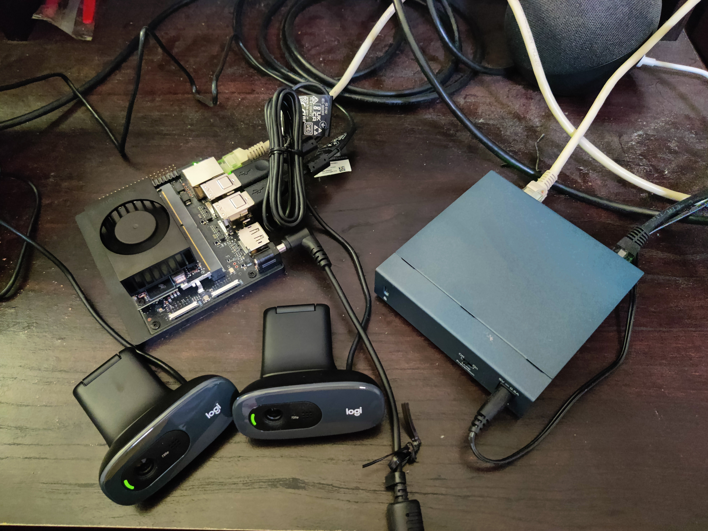
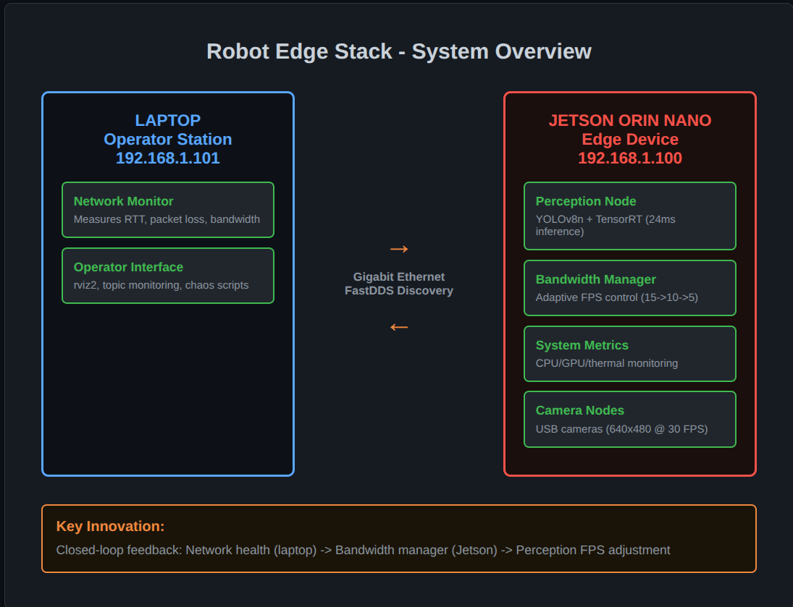
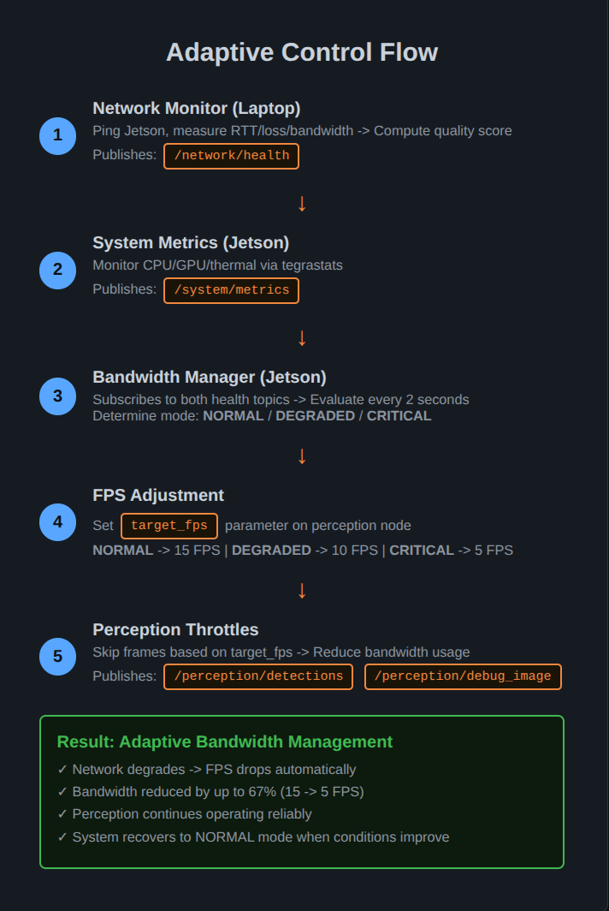
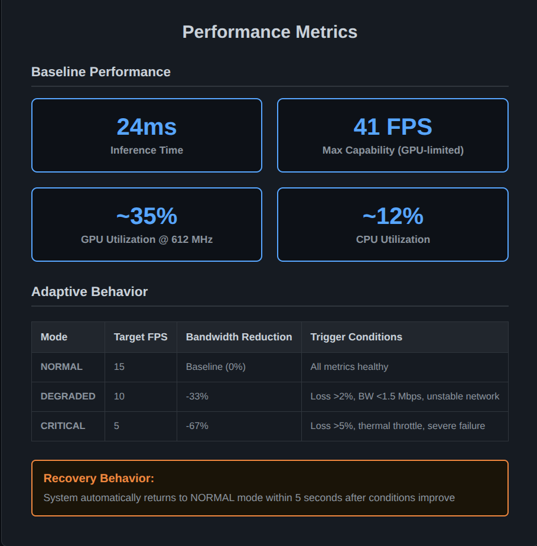
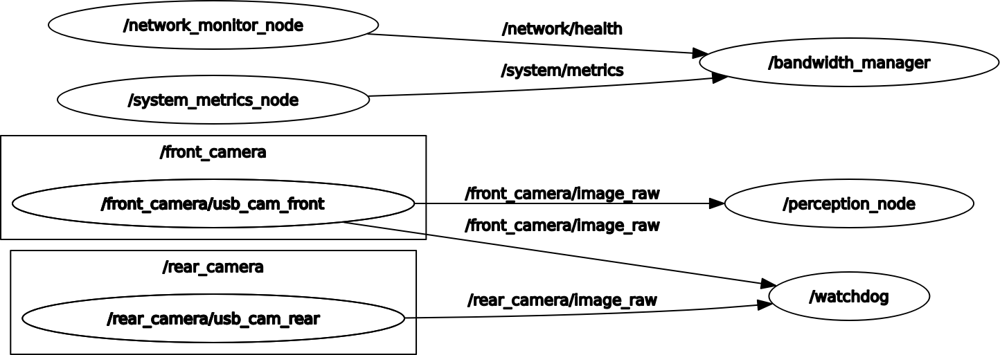

# Robot Edge Stack

**Adaptive bandwidth management for edge perception systems**

Real-time object detection on embedded hardware with network-aware FPS throttling.

[](https://docs.ros.org/en/humble/)
[](https://www.python.org/)
[](https://isocpp.org/)
[](https://developer.nvidia.com/tensorrt)
[](https://docs.docker.com/compose/)

---

## 📹 Demo Video

**[Watch the full demonstration on my portfolio →](https://runtimeterror1001.github.io/parth-portfolio/#/project/bandwidth-aware-edge-perception-system)**

90-second demonstration of adaptive FPS control under simulated network degradation.

---

## 🖥️ Hardware Setup



**NVIDIA Jetson Orin Nano Super Developer Kit** connected to operator laptop via Gigabit Ethernet. Dual USB cameras provide stereo perception for real-time object detection with adaptive bandwidth management.

---

## 🎯 Problem Statement

Edge robotics systems face a fundamental challenge: **perception workloads generate high-bandwidth streams, but network conditions are unpredictable**. A fixed-rate perception pipeline either:
- Wastes bandwidth when the network is good
- Overwhelms the network when conditions degrade
- Fails catastrophically when links drop

**Traditional approaches:** Static configuration, manual intervention, or blind retransmission.

**This project:** Dynamic adaptation based on real-time network and system health.

---

## 🚀 Solution

A multi-node ROS 2 system that **continuously monitors network health and system resources**, then **automatically adjusts perception frame rate** to match available bandwidth while maintaining reliable object detection.

**Key Innovation:** Closed-loop feedback between network monitoring (laptop operator station) and perception control (Jetson edge device), with adaptive behavior through FPS throttling.

### How It Works

1. **Network Monitor** (laptop) measures RTT, packet loss, bandwidth via ping + `/proc/net/dev`
2. **System Metrics** (Jetson) tracks CPU/GPU utilization, temperature, throttling via `tegrastats`
3. **Bandwidth Manager** (Jetson) evaluates combined health → determines mode (NORMAL/DEGRADED/CRITICAL)
4. **Perception Node** (Jetson) receives FPS adjustment via ROS 2 parameter service → throttles processing

**Result:** Perception seamlessly adapts from 15 FPS → 10 FPS → 5 FPS as network degrades, reducing bandwidth by up to 67% while continuing to operate.

---

## 🏗️ System Architecture

### System Overview



### Adaptive Control Flow



### Performance Metrics



### ROS 2 Graph



---

## ✨ Key Features

- ✅ **Real-time network health monitoring** - RTT, jitter, packet loss, bandwidth utilization
- ✅ **Hardware metrics integration** - NVIDIA Jetson GPU/CPU/thermal monitoring via `tegrastats`
- ✅ **Adaptive FPS control** - Dynamic parameter updates to perception node (no restart required)
- ✅ **YOLOv8 + TensorRT inference** - 24ms inference time (~41 FPS capability) on Jetson Orin Nano
- ✅ **Multi-machine ROS 2 deployment** - FastDDS discovery server for reliable Jetson ↔ laptop communication
- ✅ **Network chaos engineering** - Testing scripts for latency/loss/jitter injection
- ✅ **Production deployment** - Docker Compose with auto-restart, proper dependency ordering

---

## 📦 Components

### 1. `stack_msgs` (C++ Interface Package)
Custom ROS 2 messages for health monitoring:
- `NetworkHealth.msg` - RTT, packet loss, bandwidth, quality score, stability flag
- `SystemMetrics.msg` - CPU/GPU utilization, temps, power draw, throttle state

### 2. `health_monitor` (Python Package)
Three monitoring nodes running on respective machines:

**`network_monitor_node`** (Laptop)
- Pings Jetson to measure RTT (min/avg/max/stddev)
- Parses `/proc/net/dev` for RX/TX bandwidth
- Computes quality score (0-100) and stability flag
- Publishes to `/network/health` at configurable rate

**`system_metrics_node`** (Jetson)
- Uses `psutil` for CPU/RAM metrics
- Parses `tegrastats` output for GPU freq/utilization/temperature
- Detects thermal throttling (frequency scaling + temp gate)
- Publishes to `/system/metrics` at 1 Hz

**`watchdog_node`** (Jetson)
- Monitors topic liveness (cameras, heartbeat)
- Restarts Docker containers on timeout
- Publishes system health status

### 3. `bandwidth_manager` (Python Package)
**`bandwidth_manager_node`** (Jetson)
- Subscribes to `/network/health` and `/system/metrics`
- Evaluates combined state every 2 seconds
- Determines mode: NORMAL / DEGRADED / CRITICAL
- Sets `target_fps` parameter on perception node via service call
- Includes cooldown (5s) to prevent oscillation

**Mode Logic:**
```python
CRITICAL: quality < 40 OR loss > 5% OR temp >= 85°C OR throttled
DEGRADED: quality < 70 OR loss > 2% OR bandwidth < 1.5 Mbps OR CPU > 80% OR GPU > 85% OR unstable
NORMAL:   All thresholds within acceptable range
```

**FPS Mapping:**
- NORMAL → 15 FPS
- DEGRADED → 10 FPS (-33% bandwidth)
- CRITICAL → 5 FPS (-67% bandwidth)

### 4. `perception` (C++ Package)
**`perception_node`** (Jetson)
- Subscribes to `/front_camera/image_raw` (640x480 MJPEG)
- Runs YOLOv8n inference via TensorRT engine
- Publishes to `/perception/detections` (vision_msgs/Detection2DArray)
- Publishes to `/perception/debug_image` (annotated bounding boxes)
- **Adaptive FPS:** Listens for `target_fps` parameter changes, throttles processing accordingly

**Inference Pipeline:**
1. Preprocess: BGR → RGB, resize to 640x640, normalize [0,1], convert to CHW
2. TensorRT inference: FP16 precision, ~24ms per frame
3. Postprocess: Parse [84, 8400] output, apply NMS, scale to original size
4. Publish detections + debug visualization

---

## 📊 Performance Metrics

### Baseline (NORMAL Mode)
- **Inference Time:** 24ms per frame
- **Max FPS Capability:** ~41 FPS (GPU-limited)
- **Target FPS:** 15 FPS (configurable)
- **Bandwidth Usage:** ~2.5 Mbps (camera + detections)
- **GPU Utilization:** ~35% @ 612 MHz
- **CPU Utilization:** ~12%

### Adaptive Behavior
| Mode      | Target FPS | Bandwidth Reduction | Trigger Conditions                |
|-----------|------------|---------------------|-----------------------------------|
| NORMAL    | 15         | Baseline            | All metrics healthy               |
| DEGRADED  | 10         | -33%                | Loss >2%, BW <1.5 Mbps, unstable  |
| CRITICAL  | 5          | -67%                | Loss >5%, thermal, severe network |

**Recovery:** System returns to NORMAL mode within cooldown period (5s) after conditions improve.

---

## 🛠️ Tech Stack

### Software
- **ROS 2 Humble** - Robotics middleware
- **FastDDS** - DDS implementation with discovery server
- **Python 3.10** - Monitoring and control nodes
- **C++17** - Perception and TensorRT inference
- **TensorRT 8.6** - NVIDIA inference optimization
- **OpenCV 4.5** - Image processing
- **Docker Compose** - Multi-container orchestration

### Hardware
- **NVIDIA Jetson Orin Nano** - 8GB, 1024-core Ampere GPU
- **Laptop Operator Station** - Ubuntu 22.04, x86_64
- **USB Cameras** - 640x480 @ 30 FPS (usb_cam driver)
- **Gigabit Ethernet** - Static IPs (Jetson: .100, Laptop: .101)

---

## 🚀 Quick Start

### Prerequisites
- Jetson Orin Nano with JetPack 6.x (includes TensorRT, CUDA)
- Laptop running Ubuntu 22.04
- Both machines on same Ethernet network

### 1. Clone Repository
```bash
# On both machines
git clone https://github.com/runtimeterror1001/robot_edge_stack.git
cd robot_edge_stack
```

### 2. Setup Model (One-time)
```bash
# On laptop: Export YOLO to ONNX
pip3 install ultralytics --break-system-packages
python3 -c "
from ultralytics import YOLO
model = YOLO('yolov8n.pt')
model.export(format='onnx', simplify=True, dynamic=False, imgsz=640)
"

# Transfer to Jetson
scp yolov8n.onnx [username]@[ip_address]:~/robot_edge_stack/models/

# On Jetson: Convert to TensorRT engine
cd ~/robot_edge_stack/models
/usr/src/tensorrt/bin/trtexec \
  --onnx=yolov8n.onnx \
  --saveEngine=yolov8n.engine \
  --fp16 \
  --workspace=4096
```

### 3. Start System

**On Jetson:**
```bash
make jetson-build  # First time only
make jetson-up
make jetson-logs   # Verify all containers running
```

**On Laptop:**
```bash
make laptop-build  # First time only
make laptop-up
make laptop-logs s=network_monitor
```

### 4. Verify Operation
```bash
# On laptop - check topics
docker exec -it robot_edge_stack-operator-1 bash
source /ws/install/setup.bash
ros2 topic list
ros2 topic hz /perception/detections  # Should show ~15 Hz
```

### 5. Visualize
```bash
# On laptop operator container
rviz2
# Add: Image → /perception/debug_image
```

---

## 🌪️ Network Chaos Testing

Inject realistic network degradation to test adaptive behavior:

### Packet Loss (triggers CRITICAL mode)
```bash
cd scripts/network_chaos
./inject_loss.sh enp8s0 6%   # >5% threshold
# Watch bandwidth_manager logs: NORMAL → CRITICAL, FPS 15 → 5
./clear_chaos.sh
```

### Bandwidth Limit (triggers DEGRADED mode)
```bash
./inject_bandwidth_limit.sh enp8s0 1mbit  # <1.5 Mbps threshold
# Watch FPS drop: 15 → 10
./clear_chaos.sh
```

### Latency + Jitter (network instability)
```bash
./inject_jitter.sh enp8s0 100ms 50ms
# Watch is_stable flag toggle, possible DEGRADED mode
./clear_chaos.sh
```

See `scripts/network_chaos/README.md` for full documentation.

---

## 🔧 Configuration

### Bandwidth Manager Thresholds
Edit `src/bandwidth_manager/config/bandwidth_config.yaml`:
```yaml
evaluation_period_sec: 2.0
mode_change_cooldown_sec: 5.0
thresholds:
  quality_degraded: 70      # Network quality score
  quality_critical: 40
  packet_loss_degraded: 2.0 # Percentage
  packet_loss_critical: 5.0
  bandwidth_low_mbps: 1.5   # Minimum acceptable bandwidth
  cpu_high: 80.0            # Percentage
  gpu_high: 85.0
  temp_critical: 85.0       # Celsius
```

### Perception Parameters
Edit `src/perception/config/perception_config.yaml`:
```yaml
perception_node:
  ros__parameters:
    target_fps: 15
    camera_topic: "/front_camera/image_raw"
    engine_path: "/ws/models/yolov8n.engine"
    conf_threshold: 0.25    # YOLO confidence threshold
    nms_threshold: 0.45     # Non-maximum suppression
```

---

## 📁 Project Structure
```
robot_edge_stack/
├── src/
│   ├── stack_msgs/              # Custom ROS 2 messages
│   ├── health_monitor/          # Network + system monitoring
│   ├── bandwidth_manager/       # Adaptive FPS control
│   └── perception/              # YOLOv8 + TensorRT inference
├── docker/
│   ├── jetson/                  # Jetson container configs
│   ├── operator/                # Laptop container configs
│   └── compose/                 # Docker Compose files
├── scripts/network_chaos/       # Chaos engineering tools
├── models/                      # TensorRT engine files (not committed)
├── fastdds/                     # FastDDS discovery server configs
├── docs/                        # Architecture diagrams
└── Makefile                     # Build + deployment shortcuts
```

---

## 🔮 Future Work

- [ ] Multi-camera support with camera-specific FPS control
- [ ] Tracking integration (assign persistent IDs across frames)
- [ ] Hardware-accelerated encoding (NVENC) for debug streams
- [ ] Graceful degradation to CPU inference on thermal throttle
- [ ] WebRTC dashboard for remote monitoring
- [ ] ROS bag recording triggers on anomaly detection
- [ ] Integration with path planning (object avoidance)

---

## 📄 License

Apache License - See LICENSE file for details

---

## 📧 Contact

**Parth Desai** - [GitHub](https://github.com/runtimeterror1001) | [Portfolio](https://runtimeterror1001.github.io/parth-portfolio/)

*Actively seeking robotics software engineering roles*

---

**Built with:** ROS 2 Humble • TensorRT • Docker • FastDDS • YOLOv8 • OpenCV
